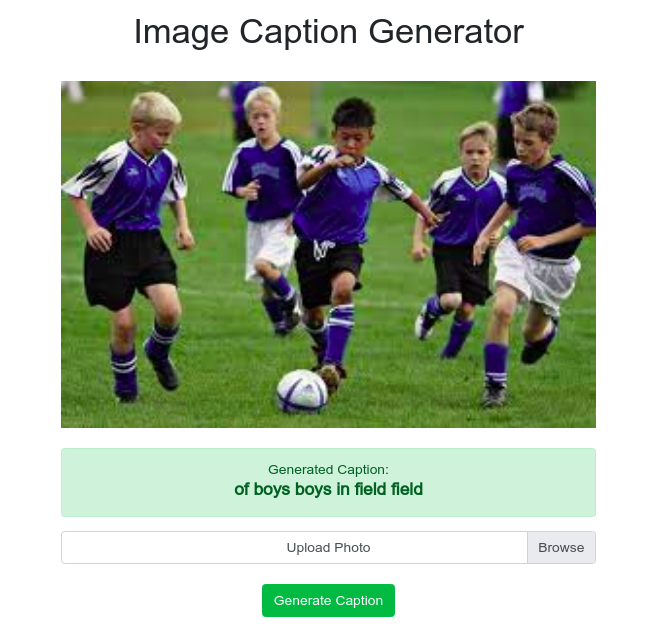

# [Caption Generation server and client](https://github.com/adityajn105/my_docker_files/tree/master/Caption%20Generator)

Setup Caption Generation tensorflow/serving API and a flask WebApp to consume that using gRPC interface.

## Usage
You can use [docker-compose file](https://github.com/adityajn105/my_docker_files/blob/master/Caption%20Generator/compose_caption_generator.yaml) which will setup whole thing for you.

	docker-compose -f compose_caption_generator.yaml up

Alternatively you can run following commands to setup whole environment.

	docker image pull adityajn105/tf_serving_caption_gen:latest

	docker image pull adityajn105/client_caption_gen:latest
	
	docker network create --driver bridge mynetwork

	docker container run -d --network=mynetwork --network-alias=tf_server adityajn105/tf_serving_caption_gen:latest
		
	docker container run -d -p 80:80 --network=mynetwork -e TF_SERVER_IP=tf_server adityajn105/client_caption_gen:latest

Visit the app on `http:localhost`

## Screenshot

## Contributors
* [Aditya Jain](https://adityajain.me)